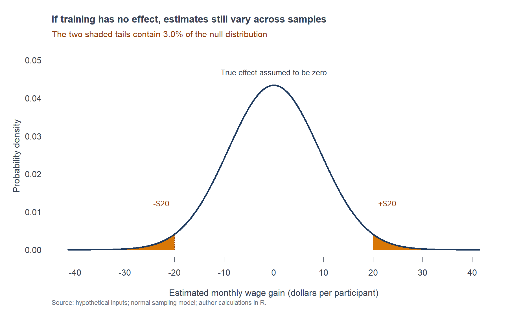

```{r}
#| label: setup
#| include: false
script <- if (file.exists("R/analysis.R")) {
  "R/analysis.R"
} else {
  "blog/posts/post1/R/analysis.R"
}
source(script)
```

Imagine a city deciding whether to fund a job-training program. An evaluation reports higher wages and a p-value of **`r p_text`**. Does that mean a 97% chance the program works? And is it enough to justify spending public money?

The first answer is no. The second needs more information. The useful question is **what this number tells a decision-maker, and what it leaves unanswered**.

There is evidence that the probability interpretation causes difficulty. In a [2022 survey by Lytsy, Hartman, and Pingel](https://pubmed.ncbi.nlm.nih.gov/35991465/), 53.3% of 75 doctoral students and 73.4% of 64 statisticians/epidemiologists interpreted a significant result as indicating that the null hypothesis was improbable. Those respondents do not establish how prevalent this interpretation is among all researchers or economists. They do provide a specific reason to examine it, rather than simply declaring that everyone gets p-values wrong.

## Imagine a world where the program does nothing

Our example is hypothetical. Suppose a randomized evaluation estimates that training raises monthly wages by **`r gain_text` dollars**, with a standard error of **`r se_text` dollars**. The standard error describes the estimate's sampling uncertainty. Assume its sampling distribution is approximately normal with this known standard error; this simplified model lets us calculate the example directly in R.

The *null hypothesis* says that the true average wage effect is zero. Even in that no-effect world, repeated evaluations would produce different estimates because they observe different samples.

For a two-sided test, we count estimates at least as far from zero as the observed gain, in either direction. Here that means an estimate of at least +`r gain_text` dollars or at most -`r gain_text` dollars.

{#fig-null fig-alt="Normal sampling distribution under a zero-effect null. Both tails beyond minus and plus 20 dollars are shaded and contain approximately 3 percent of the probability." fig-cap="A p-value counts outcomes in a hypothetical no-effect world. Shaded tails total approximately 3%. Source: author-created illustration; no observed program data."}

R gives a probability of about **`r tail_percent_text`%** for those outcomes under the null model. That is the p-value. It is a probability about possible **results assuming no effect**, not a probability that **no effect is true**.

## Why the direction matters

The reversal is tempting because we usually want the second answer: after seeing the evaluation, how likely is the program to work? But the test begins by assuming a zero effect, then evaluates the result against that assumption. It does not assign probabilities to the competing explanations.

Think of a fire alarm: knowing how often an alarm sounds when there is no fire does not, by itself, tell you the chance that a fire exists when it sounds. You also need information about actual fires and the alarm's behavior during them. Likewise, a probability for the hypothesis requires additional assumptions and information, not simply subtracting the p-value from one.

The [American Statistical Association's 2016 guidance](https://www.amstat.org/asa/files/pdfs/p-valuestatement.pdf) explicitly distinguishes p-values from probabilities that hypotheses are true, and advises against basing policy decisions solely on a significance threshold.

## Significant, but worth funding?

Because `r p_text` is below 0.05, the result would conventionally be called statistically significant. That tells us the estimate is relatively unusual under the specified no-effect model. It does not tell us the benefit is large.

```{r}
#| label: decision-table
#| tbl-cap: "Inputs and calculated results for the hypothetical training evaluation. All money amounts are monthly dollars per participant."
knitr::kable(display_table, col.names = c("Measure", "Illustrative value"), align = c("l", "r"))
```

Now suppose the program costs **`r cost_text` dollars per participant per month**. The estimated wage gain is just `r gain_text` dollars. Its model-based 95% confidence interval runs from about `r lower_text` to `r upper_text` dollars. These results describe a positive but modest gain relative to the assumed cost.

This is not a complete benefit-cost analysis: effects might last beyond the evaluation, and training could produce benefits other than wages. The example nevertheless shows why crossing 0.05 cannot settle the funding decision.

## What to ask next

For this evaluation, read the p-value alongside the estimated gain, uncertainty, study design, and program cost. **The number answers how unusual the result would be under a no-effect model; deciding whether to fund the program requires a separate judgment about benefits and costs.**

::: {.callout-note collapse="true" title="Sources and replication"}
The survey evidence comes from Lytsy, Hartman, and Pingel (2022), *Upsala Journal of Medical Sciences*, DOI [10.48101/ujms.v127.8760](https://doi.org/10.48101/ujms.v127.8760). Interpretive guidance comes from the ASA's statement by Wasserstein and Lazar (2016), DOI [10.1080/00031305.2016.1154108](https://doi.org/10.1080/00031305.2016.1154108). Both sources were accessed October 8, 2026.

All training-program amounts are invented teaching inputs, not estimates from an actual study. The normal approximation and known standard error are assumptions of this illustration. `R/analysis.R` reads `data/example_inputs.csv` and saves the figure, numeric results, plot data, and R session information to `results/`. The [GitHub folder](https://github.com/augenstern118/testrepo/tree/main/blog/posts/post1) contains a README with replication instructions. No external data download or additional R analysis package is needed.
:::

::: {.callout-note collapse="true" title="View the R code"}
```{r}
#| label: show-code
#| results: asis
cat("```r\n", paste(readLines(script, warn = FALSE), collapse = "\n"), "\n```\n", sep = "")
```
:::
